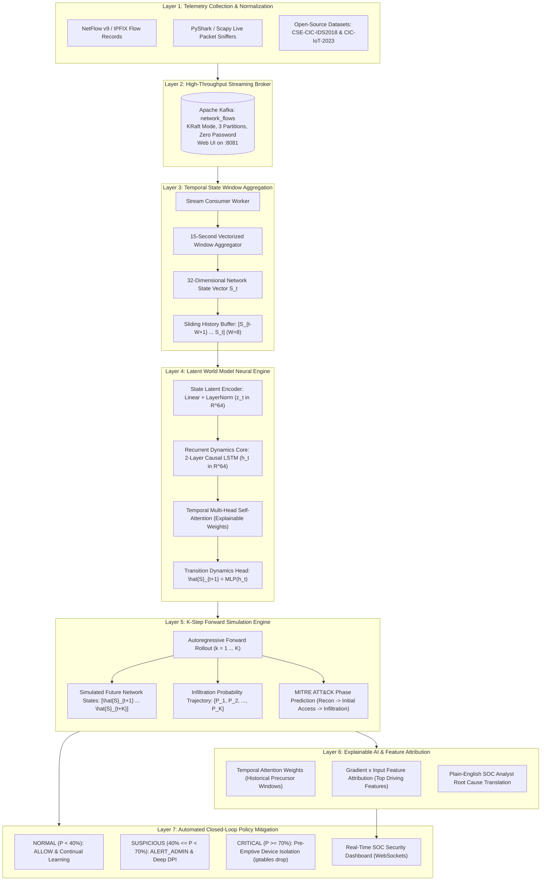

# Internal Firewall — System Architecture & World Model Design

> **Smart India Hackathon 2026**  
> **Challenge:** Proactive Cyber Defense & Infiltration Forecasting Using AI World Models  
> **Core Innovation:** Causal Transition Dynamics $P(S_{t+1} \mid S_{\le t})$ + $K$-Step Autoregressive Forward Simulation + MITRE ATT&CK Progression Mapping + Explainable AI Attribution.

---

## 1. Executive Mission & Architectural Shift

Traditional Network Intrusion Detection Systems (NIDS) and Next-Generation Firewalls (NGFW) suffer from a fundamental design flaw: **static, point-in-time classification**. They inspect individual flows or packets in isolation, completely blind to the temporal sequence and causal physics of how an adversary establishes a foothold:
- Infiltration is not a single packet; it is a multi-stage trajectory unfolding over time.
- A single port probe or SYN packet looks indistinguishable from benign network chatter.
- A slow, low-volume reconnaissance scan deliberately spaces packets across minutes to evade static rate thresholds.

### The World Model Paradigm
Rather than asking *"Is this flow benign or malicious right now?"*, our architecture asks:

> **"Given the sequence of network states observed over the last $W$ time windows, what is the probability distribution over future network states $P(S_{t+1} \mid S_{\le t})$, and does this trajectory forward-simulate into an infiltration state before compromise is completed?"**

This transforms network defense from **passive reactive alerting** into **proactive forward-simulated anticipation**.

### How the Architecture Works in Simple Words (Step-by-Step)

1. **Sniffs / Ingests Raw Network Traffic**: Collects packets and flow logs at line-rate into Apache Kafka (topic `network_flows`) without looking at any labels.
2. **Compresses Flows into 15s Fingerprints**: Summarizes 15 seconds of traffic into a **32-dimensional continuous state vector** ($S_t$) tracking connection density, port entropy, SYN/ACK handshake ratios, byte velocities, and packet inter-arrival times (IAT).
3. **Encodes the Recent 2 Minutes**: Buffers the last 8 state snapshots ($8 \times 15\text{s} = 2\text{ minutes}$) through an attention-augmented recurrent neural network to capture velocity, acceleration, and subtle turning points.
4. **Simulates Future Network Dynamics**: Predicts what the network state will look like 15 seconds ahead ($\hat{S}_{t+1}$), and autoregressively rolls forward **up to 75 seconds ahead** ($K=5$ steps).
5. **Forecasts Threat Probability & Kill-Chain Phase**: Simultaneously computes risk percentage and maps the active MITRE ATT&CK phase (Reconnaissance $\to$ Initial Access $\to$ Infiltration $\to$ C2 $\to$ Exfiltration).
6. **Executes Automated Proactive Mitigation**:
   - `Risk < 40%`: **ALLOW** (nominal operations).
   - `40% ≤ Risk < 70%`: **ALERT_ADMIN** (suspicious warning & deep packet inspection).
   - `Risk ≥ 70%`: **ISOLATE_DEVICE** (pre-emptive device isolation before kill-chain concludes).
7. **Delivers Instant Attribution**: Provides SOC analysts with exact driving feature contributions and natural language explainability.

---

## 2. End-to-End Multi-Layer Architecture

---

## 3. Mathematical Formulation of the World Model

### 3.1 Network State Representation
At uniform time windows of $\Delta t = 15\text{ seconds}$, all observed network events are aggregated into a continuous state vector $S_t \in \mathbb{R}^{32}$, encoding:
1. **Volumetric & Rate Dynamics ($8$ dims):** `flow_count`, `tot_fwd_pkts`, `tot_bwd_pkts`, `tot_fwd_bytes`, `tot_bwd_bytes`, `flow_bytes_rate`, `flow_pkts_rate`, `flow_duration_mean`.
2. **TCP Flag Distributions ($8$ dims):** `syn_flag_count`, `syn_ratio`, `ack_flag_count`, `ack_ratio`, `rst_flag_count`, `fin_flag_count`, `psh_flag_count`, `urg_flag_count`.
3. **Port & Protocol Diversity ($7$ dims):** `unique_dst_ports`, `ephemeral_port_ratio`, `web_port_ratio`, `dns_port_ratio`, `ssh_ftp_port_ratio`, `tcp_protocol_ratio`, `udp_protocol_ratio`.
4. **Timing & Packet Statistics ($6$ dims):** `pkt_len_mean`, `pkt_len_std`, `flow_iat_mean`, `flow_iat_std`, `flow_iat_max`, `down_up_ratio_mean`.
5. **TCP Window & Duty Cycle ($3$ dims):** `init_fwd_win_mean`, `active_duration_mean`, `idle_duration_mean`.

### 3.2 State Latent Encoder ($g_\phi$)
Compresses the standardized observation vector $S_t$ into latent space:
$$z_t = g_\phi(S_t) = \text{LeakyReLU}\left(\text{LN}\left(W_2 \cdot \text{LeakyReLU}(\text{LN}(W_1 S_t + b_1)) + b_2\right)\right) \in \mathbb{R}^{64}$$

### 3.3 Recurrent Causal Dynamics Core ($f_\theta$)
Models the causal temporal progression of network states over an input context window $W=8$:
$$h_t = \text{LSTM}(z_t, h_{t-1}) \in \mathbb{R}^{64}$$

### 3.4 Temporal Multi-Head Attention
Computes self-attention across the historical sequence $[t-W+1, \dots, t]$:
$$\alpha_{i} = \frac{\exp\left( \frac{q_t^\top k_i}{\sqrt{d_k}} \right)}{\sum_{j=1}^W \exp\left( \frac{q_t^\top k_j}{\sqrt{d_k}} \right)}, \quad h_{\text{attn}} = \sum_{i=1}^W \alpha_i v_i$$
The attention weights $\alpha_i$ provide transparent visibility into which historical time windows triggered the model's forward simulation forecast.

### 3.5 Multi-Task Prediction Heads
1. **Transition Dynamics Head:** $\hat{S}_{t+1} = W_{\text{dyn}} h_{\text{attn}} + b_{\text{dyn}} \in \mathbb{R}^{32}$.
2. **Infiltration Probability Head:** $\hat{y}_{\text{inf}} = \sigma(W_{\text{inf}} h_{\text{attn}} + b_{\text{inf}}) \in [0, 1]$.
3. **MITRE ATT&CK Stage Head:** $\hat{y}_{\text{stage}} = \text{Softmax}(W_{\text{stage}} h_{\text{attn}} + b_{\text{stage}}) \in \Delta^5$.

### 3.6 Composite Training Loss
$$\mathcal{L} = \mathcal{L}_{\text{dynamics}} + \lambda_{\text{inf}} \mathcal{L}_{\text{infiltration}} + \lambda_{\text{stage}} \mathcal{L}_{\text{stage}}$$
Where:
- $\mathcal{L}_{\text{dynamics}} = \frac{1}{D} \sum_{j=1}^D (\hat{S}_{t+1, j} - S_{t+1, j})^2$ (Mean Squared Error)
- $\mathcal{L}_{\text{infiltration}} = - \left[ y_{\text{inf}} \log \hat{y}_{\text{inf}} + (1 - y_{\text{inf}}) \log(1 - \hat{y}_{\text{inf}}) \right]$ (Binary Cross-Entropy)
- $\mathcal{L}_{\text{stage}} = - \sum_{c=0}^5 y_{\text{stage}, c} \log \hat{y}_{\text{stage}, c}$ (Categorical Cross-Entropy)
- Default weights: $\lambda_{\text{inf}} = 1.5, \lambda_{\text{stage}} = 1.0$.

---

## 4. $K$-Step Autoregressive Forward Simulation

Given the current observed network history $X_{\text{hist}} = [S_{t-W+1}, \dots, S_t]$:
1. Pass $X_{\text{hist}}$ into the World Model to obtain $\hat{S}_{t+1}$ and $P(\text{Infiltration}_{t+1})$.
2. Append $\hat{S}_{t+1}$ to the sequence and drop the oldest state $S_{t-W+1}$.
3. Feed the updated simulated sequence back into the model to predict $\hat{S}_{t+2}$ and $P(\text{Infiltration}_{t+2})$.
4. Repeat autoregressively for $k = 1, 2, \dots, K$ steps (default $K=5$, projecting $+75$ seconds into the future).
5. Output the **Infiltration Probability Timeline** $[P_1, P_2, \dots, P_K]$ and determine if the trajectory converges to compromise.

---

## 5. Explainable AI & Feature Attribution

To satisfy the interpretability requirement, our architecture implements:
1. **Temporal Attention Heatmap:** Reveals which past time windows in the history sequence influenced the prediction.
2. **Gradient $\times$ Input Attribution:**
   $$\text{Attribution}_j = \left| S_{t, j} \times \frac{\partial P_{\text{inf}}}{\partial S_{t, j}} \right|$$
   Identifies the top contributing features among the 32 state vector dimensions (e.g. `syn_ratio`, `unique_dst_ports`, `pkt_len_std`).
3. **SOC Summary:** Automatically synthesizes a plain-English explanation for security analysts.

---

## 6. Proactive Closed-Loop Mitigation Matrix

| Security Status | Infiltration Probability | Automated Mitigation Action |
| :--- | :---: | :--- |
| **NORMAL** | $P < 40\%$ | **ALLOW:** Forward traffic normally; update running baseline normalization. |
| **SUSPICIOUS** | $40\% \le P < 70\%$ | **ALERT_ADMIN:** Broadcast WebSocket alert; escalate to full packet capture; rate-limit suspect host. |
| **CRITICAL** | $P \ge 70\%$ | **ISOLATE_DEVICE:** Pre-emptively isolate host IP via iptables; drop active connections *before* lateral compromise concludes. |

---

## 7. Comparative Benchmark Architecture

The system benchmarks the World Model against a static **Logistic Regression** baseline trained on identical state features without sequence memory:
- **Metrics Evaluated:** Accuracy, Precision, Recall, F1-Score, False Positive Rate (FPR), ROC-AUC, and Transition Dynamics MSE Loss.
- **Key Advantage:** Demonstrates measurable F1 uplift, significant FPR reduction, and proactive early detection lead time.