# Internal Firewall — World Model Pipeline Flow

```mermaid
flowchart LR
    subgraph Col1["  ◀ COLUMN 1: TELEMETRY & WORLD MODEL  "]
        direction TB
        A["1. Telemetry Ingestion<br/>NetFlow / Packet Sniffers / CIC-IDS-2018"]
        B[("2. Streaming Broker<br/>Apache Kafka (Topic: network_flows)")]
        C["3. 15s State Aggregator<br/>32-D State Vector S_t (W=8 Context)"]
        D["4. AI Network World Model<br/>LSTM + Multi-Head Attention Core"]
        
        A --> B --> C --> D
    end

    subgraph Col2["  ▶ COLUMN 2: SIMULATION & MITIGATION  "]
        direction TB
        E["5. K-Step Forward Simulation<br/>Autoregressive Rollout (t+1 ... t+5)"]
        F["6. Explainability & Attribution<br/>Temporal Attention & Feature Rankings"]
        G["7. Autonomous Mitigation<br/>ALLOW | ALERT_ADMIN | ISOLATE_DEVICE"]
        H["8. Real-Time SOC Dashboard<br/>Live Incident Stream via WebSockets"]
        
        E --> F --> G --> H
    end

    %% Causal Transition Bridge connecting Column 1 to Column 2
    D ==>|Forward Rollout: Ŝ_t+1 & Latent z_t| E
```

---

## The Pipeline in Simple Words

1. **Ingest Raw Logs**: Sniffs live network packets or streams flow logs from the gateway into Apache Kafka (`network_flows`), discarding labels.
2. **15s State Fingerprint ($S_t$)**: Bundles all traffic over 15 seconds into a single 32-dimensional number vector representing connection volumes, port diversity, SYN/ACK ratios, byte rates, packet sizes, and inter-arrival times.
3. **2-Minute History Context ($W=8$)**: Observes the last 8 snapshots ($8 \times 15\text{s} = 2\text{ minutes}$) through a recurrent neural network with multi-head temporal self-attention to gauge traffic momentum.
4. **World Model Forward Simulation**: Predicts what the network state will look like 15 seconds in the future ($\hat{S}_{t+1}$), and loops that prediction back into itself to simulate **up to 75 seconds ahead** ($K=5$ steps).
5. **Score Infiltration & MITRE Phase**: Quantifies threat risk percentage and identifies the active kill-chain phase (Reconnaissance, Initial Access, Lateral Movement, C2, Exfiltration).
6. **Enforce Defense Automatically**:
   - `Risk < 40%` $\to$ **ALLOW** (nominal traffic).
   - `40% ≤ Risk < 70%` $\to$ **ALERT_ADMIN** (suspicious warning).
   - `Risk ≥ 70%` $\to$ **ISOLATE_DEVICE** (pre-emptive network isolation).
7. **Attribution & Transparency**: Explains which specific network features triggered the decision.