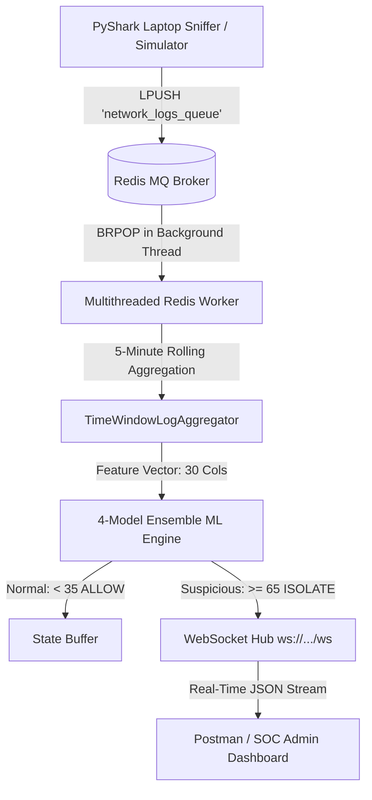

```mermaid
graph TD
    A[PyShark Laptop Sniffer / Simulator] -->|LPUSH 'network_logs_queue'| B[(Redis MQ Broker)]
    B -->|BRPOP in Background Thread| C[Multithreaded Redis Worker]
    C -->|5-Minute Rolling Aggregation| D[TimeWindowLogAggregator]
    D -->|Feature Vector: 30 Cols| E[4-Model Ensemble ML Engine]
    E -->|Normal: < 35 ALLOW | F[State Buffer]
    E -->|Suspicious: >= 65 ISOLATE | G[WebSocket Hub ws://.../ws]
    G -->|Real-Time JSON Stream| H[Postman / SOC Admin Dashboard]
```