# Internal Network Firewall — AI World Model Cyber Defense System

> **Smart India Hackathon 2026**  
> **Challenge:** AI Systems Capable of Learning Network Behaviour, Anticipating Attacker Progression & Proactive Cyber Defence Using World Models  
> **Core Innovation:** Causal Transition Dynamics $P(S_{t+1} \mid S_{\le t})$ + $K$-Step Autoregressive Forward Simulation + MITRE ATT&CK Progression Mapping + Explainable AI Attribution.

---

## Executive Summary & Problem Statement

Traditional intrusion detection systems (IDS) and next-generation firewalls (NGFW) evaluate network packets and flows in isolation, mapping them to static benign or malicious binary labels. This point-in-time approach is fundamentally blind to the **temporal progression and causal physics of modern cyber attacks**:
- An infiltration is not an isolated anomalous packet; it is a multi-stage trajectory unfolding over time.
- A single port probe or TCP SYN packet appears indistinguishable from routine network chatter.
- A stealthy reconnaissance scan deliberately delays packets across minutes to evade static rate thresholds before lateral movement and exfiltration begin.

### The AI World Model Solution
Our architecture implements an **AI World Model for Proactive Cyber Defense**. Rather than classifying static snapshots, the World Model learns an internal simulation of how network environment states evolve:

$$P(S_{t+1} \mid S_{\le t})$$

Given an observed historical sequence of 15-second aggregated network state vectors $S_t \in \mathbb{R}^{32}$, the model:
1. **Simulates Network State Physics:** Autoregressively generates predicted future network states $\hat{S}_{t+1}$.
2. **Rolls Out $K$ Steps Ahead:** Forward-simulates the network trajectory up to 75 seconds into the future ($[\hat{S}_{t+1}, \dots, \hat{S}_{t+K}]$).
3. **Forecasts Infiltration Risk:** Produces a future risk timeline $[P_1, \dots, P_K]$ before compromise is completed.
4. **Anticipates MITRE ATT&CK Stages:** Tracks attacker progression across canonical tactics (Reconnaissance $\to$ Initial Access $\to$ Lateral Movement $\to$ Command & Control $\to$ Exfiltration).
5. **Provides Root-Cause Explainability:** Uses temporal self-attention weights and gradient-based input feature attribution to pinpoint exact driving features (SYN ratios, port scans, byte rates).

---

## How the System Works in Simple Words

1. **System Ingests Network Logs**: Captures raw network packets and flow records from the gateway into Apache Kafka (`network_flows`). Labels are discarded—the model only inspects pure physical connection signals.
2. **Compresses Flows into 15-Second Snapshots**: Groups all flows over each 15-second window into a **32-dimensional fingerprint** ($S_t$) representing connection count, port diversity, SYN/ACK ratios, byte rates, packet sizes, and inter-arrival times (IAT).
3. **Observes the Recent 2 Minutes**: Buffers the last 8 snapshots ($8 \times 15\text{s} = 2\text{ minutes}$) through a recurrent neural network with multi-head temporal self-attention to gauge traffic velocity and momentum.
4. **Imagines the Immediate Future (World Model Rollout)**: Autoregressively forecasts the network's state for the next 15 seconds ($\hat{S}_{t+1}$), and loops that prediction back into itself to simulate **30s, 45s, 60s, and 75s ahead** ($K=5$ rollout steps).
5. **Calculates Infiltration Probability & MITRE Phase**: Quantifies threat risk percentage and maps the anticipated kill-chain phase.
6. **Enforces Autonomous Policy Action**:
   - `Risk < 40%` $\to$ **ALLOW** (nominal operations).
   - `40% ≤ Risk < 70%` $\to$ **ALERT_ADMIN** (suspicious warning & deep packet inspection).
   - `Risk ≥ 70%` $\to$ **ISOLATE_DEVICE** (pre-emptive network isolation before compromise finishes).
7. **Explains the Root Cause**: Visualizes temporal attention weights and ranks top contributing features (e.g., *25% packet burst, 16% byte rate, 12% SYN flood*).

---

## High-Level System Architecture

```mermaid
flowchart LR
    subgraph Col1["  ◀ COLUMN 1: TELEMETRY & WORLD MODEL  "]
        direction TB
        A["1. Telemetry Ingestion<br/>NetFlow / Packet Sniffers / CIC-IDS-2018"]
        B[("2. Streaming Broker<br/>Apache Kafka (Topic: network_flows)")]
        C["3. 15s State Aggregator<br/>32-D State Vector S_t (W=8 Context)"]
        D["4. AI Network World Model<br/>LSTM + Multi-Head Attention Core"]
        
        A --> B --> C --> D
    end

    subgraph Col2["  ▶ COLUMN 2: SIMULATION & MITIGATION  "]
        direction TB
        E["5. K-Step Forward Simulation<br/>Autoregressive Rollout (t+1 ... t+5)"]
        F["6. Explainability & Attribution<br/>Temporal Attention & Feature Rankings"]
        G["7. Autonomous Mitigation<br/>ALLOW | ALERT_ADMIN | ISOLATE_DEVICE"]
        H["8. Real-Time SOC Dashboard<br/>Live Incident Stream via WebSockets"]
        
        E --> F --> G --> H
    end

    %% Causal Transition Bridge connecting Column 1 to Column 2
    D ==>|Forward Rollout: Ŝ_t+1 & Latent z_t| E
```



---

## Repository Structure

```
internal-firewall-sih-2026/
├── ml/                       # Machine Learning World Model & Benchmarking
│   ├── src/
│   │   ├── features/         # 15s state windowing & flow/pcap extraction
│   │   ├── world_model/      # LSTM + Attention World Model, Forward Simulator & XAI
│   │   ├── baseline/         # Static Logistic Regression benchmark
│   │   ├── evaluation/       # Benchmark metrics, F1, FPR, and lead time
│   │   └── mitre_mapping.py  # MITRE ATT&CK phase mapping
│   ├── train.py              # Unified training & benchmarking CLI
│   ├── demo.py               # Interactive forward simulation CLI (terminal / markdown / text)
│   └── README.md             # ML engine documentation
│
├── backend/                  # FastAPI Streaming Gateway & WebSocket Hub
│   ├── src/
│   │   ├── main.py           # REST routes, health checks, WebSocket hub
│   │   ├── kafka_worker.py   # Asynchronous Kafka flow consumer & alert broadcaster
│   │   └── world_model_service.py # Stateful window aggregator & forward simulation engine
│   └── README.md             # Backend documentation & API schema
│
├── logger/                   # Network Telemetry Logger & Kafka Producer
│   ├── main.py               # Unified Typer CLI (--day, --attack, sniff, pcap)
│   ├── src/
│   │   ├── day_replayer.py   # CSE-CIC-IDS2018 day flow stream replayer to Kafka
│   │   ├── sniffer.py        # PyShark live packet sniffer to Kafka
│   │   └── parser.py         # PCAP and network packet parser
│   └── README.md             # Logger usage and CLI options
│
├── simulator/                # Synthetic Threat Traffic Generator
│   ├── simulate.py           # Simulates multi-stage attack scenarios (HTTP REST / Redis)
│   ├── traffic_generator.py  # Asynchronous HTTP / Redis traffic dispatcher
│   ├── scenarios.py          # Workload profiles (normal baseline vs suspicious bursts)
│   └── README.md             # Simulator documentation
│
├── dashboard/                # Next.js SOC Security Frontend (Next.js 16 / React 19)
│   ├── src/
│   │   ├── app/              # App router & global styles
│   │   └── components/
│   │       ├── Dashboard.tsx # Main SOC console with live radar, WebSocket feed, risk charts
│   │       ├── alerts/       # Real-time incident feed & device isolation triggers
│   │       └── charts/       # Threat risk distribution visualizations
│   └── README.md             # Dashboard documentation
│
├── GUIDE.md                  # Comprehensive developer guide
├── ARCHITECTURE.md           # Deep architectural design and mathematical formulation
├── FLOW.md                   # Visual data pipeline flow
├── WORKFLOW.md               # Detailed technical workflow and presentation guide
├── COMMANDS.md               # Complete operational command reference
└── MIGRATION.md              # Problem statement, challenge background & objectives
```

---

## Quickstart: End-to-End System in 4 Steps

### Step 1: Start Apache Kafka & Kafka UI
Launch the message broker (KRaft mode, port 9092, zero password) and Kafka UI (port 8081):
```bash
docker compose up -d kafka kafka-ui
```
- Kafka Broker: `localhost:9092`
- Kafka Web UI: `http://localhost:8081`

### Step 2: Start the FastAPI Backend Gateway
Launch the AI World Model service and WebSocket stream:
```bash
cd backend
WINDOW_SECONDS=15 uv run uvicorn src.main:app --host 0.0.0.0 --port 8000 --reload
```
- Interactive API Docs: `http://localhost:8000/docs`
- Health Check: `http://localhost:8000/health`
- WebSocket Feed: `ws://localhost:8000/ws/alerts`

### Step 3: Stream Day Telemetry into Kafka
Stream calibrated attack flows or benign baseline traffic from the CSE-CIC-IDS2018 benchmark:
```bash
cd logger

# Replay Thursday Infiltration and Lateral Movement attack
uv run logger --day=thursday --scenario=attack --max-flows=200 --rate=100

# Or replay Wednesday FTP/SSH Brute Force attack
uv run logger --attack=bruteforce --scenario=attack --max-flows=200 --rate=100

# Or replay nominal benign baseline traffic
uv run logger --attack=benign --max-flows=200 --rate=100
```

### Step 4: Launch Next.js SOC Security Dashboard
Open the real-time security dashboard:
```bash
cd dashboard
pnpm install
pnpm dev
```
Navigate to **`http://localhost:3000`** in your browser.

---

## Machine Learning: Training & Benchmarking

### Train the AI World Model & Evaluate Baseline
Trains the Attention-Augmented Recurrent World Model, trains the static Logistic Regression baseline, benchmarks comparative metrics, and saves weights to `models/world_model.pt`:
```bash
cd ml
uv run python train.py --sample-frac 0.15 --epochs 12 --window-size 15 --seq-len 8
```

### Run Forward Simulation Demo & Export Reports
Evaluates raw network telemetry, executes $K$-step autoregressive forward simulation, and outputs rich tables and reports:
```bash
cd ml
# Infiltration evaluation (Thursday-01-03-2018)
uv run python demo.py --file data/external-network/cic-ids-2018/Thursday-01-03-2018_TrafficForML_CICFlowMeter.csv --rollout-steps 5

# Export publication-quality Markdown report
uv run python demo.py --file data/external-network/cic-ids-2018/Thursday-01-03-2018_TrafficForML_CICFlowMeter.csv \
  --rollout-steps 5 \
  --output reports/demo_thursday_infiltration.md
```

---

## Complete Documentation Index

| Document | Description |
| :--- | :--- |
| **[GUIDE.md](file:///home/piush/Prog/hackathons/internal-firewall-sih-2026/GUIDE.md)** | Single, exhaustive developer guide covering architecture, math, code map, forward simulation, XAI, and workflows |
| **[ARCHITECTURE.md](file:///home/piush/Prog/hackathons/internal-firewall-sih-2026/ARCHITECTURE.md)** | Deep architectural rationale, 7-layer design, state vector formulation, and multi-task loss functions |
| **[FLOW.md](file:///home/piush/Prog/hackathons/internal-firewall-sih-2026/FLOW.md)** | Clear 2-column Mermaid diagram of the end-to-end data pipeline and plain-language explanation |
| **[WORKFLOW.md](file:///home/piush/Prog/hackathons/internal-firewall-sih-2026/WORKFLOW.md)** | Step-by-step workflow guide, 32-D state breakdown, autoregressive math, and policy mitigation matrix |
| **[COMMANDS.md](file:///home/piush/Prog/hackathons/internal-firewall-sih-2026/COMMANDS.md)** | Operational command cheatsheet for running every tool, CLI flag, report generation, and full integration |
| **[MIGRATION.md](file:///home/piush/Prog/hackathons/internal-firewall-sih-2026/MIGRATION.md)** | Original SIH 2026 problem statement, challenge background, and expected solution requirements |
| **[backend/README.md](file:///home/piush/Prog/hackathons/internal-firewall-sih-2026/backend/README.md)** | FastAPI backend streaming gateway, Kafka consumer worker, REST routes, and WebSocket feed documentation |
| **[logger/README.md](file:///home/piush/Prog/hackathons/internal-firewall-sih-2026/logger/README.md)** | Telemetry replayer, PyShark live sniffer, PCAP parser, and Kafka message producer documentation |
| **[ml/README.md](file:///home/piush/Prog/hackathons/internal-firewall-sih-2026/ml/README.md)** | World Model neural network, state window aggregator, forward simulator, and benchmarking documentation |
| **[dashboard/README.md](file:///home/piush/Prog/hackathons/internal-firewall-sih-2026/dashboard/README.md)** | Next.js SOC Security Operations Center dashboard documentation and setup instructions |
| **[simulator/README.md](file:///home/piush/Prog/hackathons/internal-firewall-sih-2026/simulator/README.md)** | Synthetic workload and threat generator documentation (HTTP REST & Redis target modes) |
