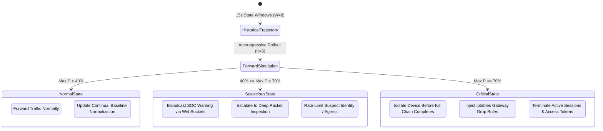

# Network World Model Cyber Defense: Technical Workflow & Architecture

> **Smart India Hackathon (SIH 2026)**  
> **Challenge:** AI Systems Capable of Learning Network Behaviour, Anticipating Attacker Progression & Proactive Cyber Defence Using World Models  
> **Core Architecture:** Streaming Flow Ingestion $\to$ 15-Second State Window Aggregation $\to$ Attention-Augmented Recurrent World Model $\to$ $K$-Step Autoregressive Forward Simulation $\to$ MITRE ATT&CK Progression Mapping $\to$ Proactive Policy Enforcement.

---

## Executive Summary

Traditional perimeter intrusion detection systems (IDS) and firewalls treat network packets and flow records in isolation, mapping each static observation to a binary benign/malicious label. This discards the fundamental **temporal and causal structure** of cyber attacks:
- The sequence in which reconnaissance port probes unfold.
- The subtle TCP SYN flag distribution that precedes an exploit attempt.
- The inter-arrival timing (IAT) of scanning packets before lateral movement and exfiltration begin.

Our solution implements an **AI World Model for Proactive Cyber Defense**. Rather than classifying static snapshots, the World Model learns an internal simulation of how network environment states evolve over time:

$$P(S_{t+1} \mid S_{\le t})$$

By observing continuous, 15-second aggregated network state vectors $S_t \in \mathbb{R}^{32}$, the model **simulates $K$ steps forward into the future**, anticipating infiltration probability trajectories and attack stage transitions before compromise is completed.

---

## In Simple Words: How the Pipeline Works

1. **System Ingests Network Logs**: Continuously collects network packets and flow logs from the gateway or packet sniffers. It ignores all attack names or labels—it only inspects raw connection numbers.
2. **Groups Traffic into 15-Second Snapshots**: Rather than looking at 1 packet at a time, it aggregates all flows over each 15-second period into a **32-number fingerprint** ($S_t$) representing connection count, port diversity, SYN/ACK ratios, byte rates, packet sizes, and inter-arrival times (IAT).
3. **Watches the Recent Past (The Last 2 Minutes)**: Passes the last 8 snapshots ($8 \times 15\text{s} = 2\text{ minutes}$) through an attention-augmented recurrent neural network to understand network momentum and velocity.
4. **Imagines the Immediate Future (World Model Simulation)**: Autoregressively forecasts the network's state for the next 15 seconds ($\hat{S}_{t+1}$), and loops that prediction back into itself to simulate **30s, 45s, 60s, and 75s ahead** ($K=5$ rollout steps).
5. **Calculates Threat Risk & MITRE ATT&CK Phase**: For each future step, outputs an **Infiltration Probability (%)** and anticipated kill-chain phase (Reconnaissance, Initial Access, Lateral Movement, C2, Exfiltration).
6. **Enforces Autonomous Policy Action**:
   - **Risk < 40%**: Status `NORMAL` $\to$ Action: `ALLOW`.
   - **40% ≤ Risk < 70%**: Status `SUSPICIOUS` $\to$ Action: `ALERT_ADMIN`.
   - **Risk ≥ 70%**: Status `CRITICAL` $\to$ Action: `ISOLATE_DEVICE` (pre-emptively isolates host IP before breach completes).
7. **Explains the Root Cause**: Outputs exact feature attributions (e.g. *25% packet burst, 16% byte rate, 12% SYN flood*) giving SOC teams instant actionable transparency.

---

## High-Level System Architecture

```mermaid
flowchart LR
    subgraph Col1["◀ COLUMN 1: INGESTION, STATE WINDOWING & WORLD MODEL"]
        direction TB
        
        subgraph Sources["1. Heterogeneous Network Telemetry"]
            direction TB
            L1["NetFlow / IPFIX Flow Records"]
            L2["PyShark / Scapy Packet Sniffers"]
            L3["CSE-CIC-IDS2018 & CIC-IoT-2023"]
        end

        subgraph Broker["2. Decoupled Streaming Broker"]
            Q[("Apache Kafka<br/>Topic: network_flows<br/>KRaft Mode (Port 9092)")]
        end

        subgraph Windowing["3. Temporal State Windowing"]
            direction TB
            W1["Stream Consumer Worker"]
            W2["15-Second State Aggregator"]
            W3["32-D State Vector S_t<br/>(Flow Rates, Flags, Ports, IAT)"]
            W4["Context Window [S_t-W+1 ... S_t] (W=8)"]
            W1 --> W2 --> W3 --> W4
        end

        subgraph WorldModel["4. Latent World Model Engine"]
            direction TB
            M1["State Latent Encoder (z_t in R^64)"]
            M2["Recurrent Dynamics Core (LSTM)"]
            M3["Temporal Multi-Head Attention"]
            M4["Transition Dynamics Head: P(S_t+1 | S_<=t)"]
            M1 --> M2 --> M3 --> M4
        end

        Sources -->|Raw Flows / Packets| Broker
        Broker -->|Stream Consume| Windowing
        W4 --> WorldModel
    end

    subgraph Col2["▶ COLUMN 2: FORWARD SIMULATION, XAI & DEFENSE"]
        direction TB
        
        subgraph Simulation["5. K-Step Forward Simulation Engine"]
            direction TB
            S1["Autoregressive Rollout (k = 1 ... K)"]
            S2["Projected States: [S_t+1 ... S_t+K]"]
            S3["Infiltration Risk Timeline: [P_1 ... P_K]"]
            S4["MITRE Stage: Recon → Infil → C2 → Exfil"]
            S1 --> S2 & S3 & S4
        end

        subgraph Explainability["6. Explainable AI & Attribution"]
            direction TB
            X1["Temporal Attention Weights (Precursor Focus)"]
            X2["Gradient × Input Feature Attribution"]
            X3["Plain-English SOC Root Cause"]
            X1 --> X3
            X2 --> X3
        end

        subgraph Actions["7. Proactive Closed-Loop Mitigation"]
            direction TB
            P1["NORMAL (P < 40%): Allow & Learn"]
            P2["SUSPICIOUS (40% <= P < 70%): Admin Alert"]
            P3["CRITICAL (P >= 70%): Isolate Device"]
            P4["Real-Time SOC Dashboard (WebSockets)"]
            P1 & P2 & P3 --> P4
        end

        Simulation --> Explainability
        Simulation --> Actions
        Explainability -.-> P4
    end

    %% Cross-Column Causal Forward Dynamics Bridge
    M4 ==>|Forward Simulation Rollout: Ŝ_t+1 & Latent z_t| S1
```



---

## Step-by-Step Technical Workflow

### Step 1: Telemetry Collection & Normalization
Network probes, gateway sensors, or packet sniffers (PyShark/Scapy) capture raw traffic and extract flow-level and packet-level metadata:
- **Flow-Level Attributes (NetFlow / IPFIX format):** Source/destination IP and port pairs, TCP flag bitmask (SYN, ACK, FIN, RST, PSH, URG), protocol, byte counts, packet counts, duration, and inter-arrival time (IAT) statistics.
- **Packet-Level Attributes (PCAP-derived):** Time-To-Live (TTL), TCP window size, fragment flags, payload size distribution, and port access patterns.

Each event is serialized into a standard JSON schema and streamed asynchronously into the message broker.

---

### Step 2: Decoupled High-Throughput Streaming Broker (Apache Kafka)
The ingestion pipeline is decoupled from model computation via a high-throughput **Apache Kafka Message Broker** (`network_flows` topic):
- **Zero Ingestion Latency:** Line-rate packet and flow record ingestion without backpressure.
- **Partitioned Scalability:** 3 partitions in KRaft mode (no Zookeeper overhead, zero password).
- **Asynchronous Consumer Groups:** Backend workers (`firewall_world_model_group`) consume and buffer flow records asynchronously.
- **Observability:** Kafka Web UI (`http://localhost:8081`) for live topic inspection and consumer group lag monitoring.
- **Direct REST Alternative:** Direct HTTP flow ingestion endpoint (`POST /api/v1/logs/ingest`) also available for standalone testing.

---

### Step 3: 15-Second Temporal State Window Aggregation ($S_t \in \mathbb{R}^{32}$)
Single flows lack sufficient context to determine attack progression. The `StateWindowAggregator` accumulates flows across **15-second uniform time windows**, computing a dense 32-dimensional Network State Vector $S_t$:

| Category | Vector Features | Security Significance |
| :--- | :--- | :--- |
| **Volumetric Dynamics** | `flow_count`, `tot_fwd_pkts`, `tot_bwd_pkts`, `tot_fwd_bytes`, `tot_bwd_bytes`, `flow_bytes_rate`, `flow_pkts_rate`, `flow_duration_mean` | Detects volumetric flooding, sudden exfiltration bursts, and bandwidth spikes. |
| **TCP Flag Bitmasks** | `syn_flag_count`, `syn_ratio`, `ack_flag_count`, `ack_ratio`, `rst_flag_count`, `fin_flag_count`, `psh_flag_count`, `urg_flag_count` | Identifies SYN floods, half-open port scans, teardown anomalies, and push floods. |
| **Port & Protocol Diversity** | `unique_dst_ports`, `ephemeral_port_ratio` ($\ge 1024$), `web_port_ratio` (80/443), `dns_port_ratio` (53), `ssh_ftp_port_ratio` (21/22), `tcp_protocol_ratio`, `udp_protocol_ratio` | Signals reconnaissance scans, lateral RPC probing, unauthorized protocol abuse. |
| **Timing & Packet Stats** | `pkt_len_mean`, `pkt_len_std`, `flow_iat_mean`, `flow_iat_std`, `flow_iat_max`, `down_up_ratio_mean` | Exposes stealthy low-and-slow port scans and tunneling payloads. |
| **Session Control** | `init_fwd_win_mean`, `active_duration_mean`, `idle_duration_mean` | Captures TCP window manipulation and anomalous beaconing duty cycles. |

---

### Step 4: Attention-Augmented Recurrent World Model
The World Model processes a sliding history trajectory of $W=8$ states: $[S_{t-W+1}, \dots, S_t]$:
1. **State Encoder:** Projects raw $S_t \in \mathbb{R}^{32}$ into latent representation $z_t \in \mathbb{R}^{64}$ with LayerNorm and LeakyReLU activations.
2. **Recurrent Dynamics Core (LSTM):** Models causal temporal transitions $h_t = \text{LSTM}(z_t, h_{t-1})$.
3. **Temporal Multi-Head Attention:** Attends over historical time steps to capture long-range temporal dependencies and produce explainable attention weights.
4. **Transition Dynamics Head:** Predicts the next physical network state: $\hat{S}_{t+1} = \text{MLP}(h_t)$.
5. **Composite Multi-Task Loss:**
   $$\mathcal{L} = \mathcal{L}_{\text{dynamics}} + 1.5 \mathcal{L}_{\text{infiltration}} + 1.0 \mathcal{L}_{\text{stage}}$$

---

### Step 5: $K$-Step Autoregressive Forward Simulation
Unlike static classifiers that only react *after* an attack has arrived, the World Model forward-simulates future environment states:

$$\begin{aligned}
\hat{S}_{t+1} &= \text{WorldModel}(S_{t-W+1}, \dots, S_t) \\
\hat{S}_{t+2} &= \text{WorldModel}(S_{t-W+2}, \dots, \hat{S}_{t+1}) \\
&\ \ \vdots \\
\hat{S}_{t+K} &= \text{WorldModel}(\dots, \hat{S}_{t+K-1})
\end{aligned}$$

At each future rollout step $t+k$, the engine predicts:
- **Infiltration Probability ($P_k$):** Projected threat trajectory $[P_1, P_2, \dots, P_K]$.
- **Convergence Step:** Exact future time step where probability crosses the critical threshold.
- **Projected Network Telemetry:** Expected flow counts, SYN ratios, and byte rates under attack conditions.

---

### Step 6: MITRE ATT&CK Tactical Progression Mapping
The World Model maps evolving network dynamics directly to canonical MITRE ATT&CK stages:

```
[ Benign Operational Baseline ]
              │
              ▼ (Probing, SYN scans, high unique ports)
     [ 1. Reconnaissance ] ────► T1046 (Network Service Scanning), T1595 (Active Scanning)
              │
              ▼ (Brute force, credential spraying, web exploits)
     [ 2. Initial Access ] ────► T1190 (Exploit Public-Facing App), T1110 (Brute Force)
              │
              ▼ (Internal exploitation, SMB/RDP pivot, privilege escalation)
 [ 3. Infiltration / Lateral ] ─► T1210 (Exploitation of Remote Services), T1021 (Remote Services)
              │
              ▼ (ARES bot check-in, periodic beaconing, reverse shells)
   [ 4. Command & Control ] ───► T1071 (Application Layer Protocol), T1573 (Encrypted Channel)
              │
              ▼ (High outbound data burst or DoS disruption)
 [ 5. Exfiltration / Impact ] ─► T1048 (Exfiltration Over Alt Protocol), T1499 (Endpoint DoS)
```

---

### Step 7: Explainable AI & Driving Feature Attribution
For every prediction, the system eliminates black-box obscurity:
- **Temporal Attention Distribution:** Highlights which past time window triggered the forecast.
- **Gradient $\times$ Input Attribution:** Measures each feature's contribution:
  $$\text{Attribution}_j = \left| S_{t, j} \times \frac{\partial P_{\text{inf}}}{\partial S_{t, j}} \right|$$
- **SOC Analyst Translation:** Generates plain-English explanations (e.g. *"[CRITICAL] Forward dynamics forecast threat escalation driven by: abnormal SYN packet concentration (42% attribution); rapid multi-port scanning activity across 318 distinct ports"*).

---

### Step 8: Proactive Closed-Loop Policy Mitigation Matrix



| Security Status | Forecasted Infiltration Prob | Tactical Mitigation Action |
| :--- | :---: | :--- |
| **NORMAL** | $0 \le P < 40\%$ | **ALLOW:** Pass traffic; update running normal baseline parameters. |
| **SUSPICIOUS** | $40\% \le P < 70\%$ | **ALERT_ADMIN:** Broadcast WebSocket alert; escalate to full packet capture; rate-limit suspect host. |
| **CRITICAL** | $70\% \le P \le 100\%$ | **ISOLATE_DEVICE:** Pre-emptively isolate host IP via iptables; drop active connections *before* lateral compromise concludes. |

---

## Key Technical Advantages for SIH 2026 Evaluation

| # | Feature | Static IDS / Baseline | AI World Model (Our Solution) |
| :-: | :--- | :--- | :--- |
| **1** | **Temporal Causality** | Treats packets/flows in isolation. | Models sequential transitions $P(S_{t+1} \mid S_{\le t})$ across sliding history. |
| **2** | **Proactive Lead Time** | Alerts only *after* damage occurs ($t=0$). | Simulates $K$ steps ahead; alerts **$K$ windows in advance** ($t+K$). |
| **3** | **Kill Chain Anticipation** | Blind to attack progression. | Anticipates MITRE ATT&CK trajectory from Reconnaissance to Infiltration. |
| **4** | **Explainability** | Black-box output. | Temporal attention heatmaps + gradient feature attributions. |
| **5** | **Offline Capability** | Often relies on cloud threat feeds. | Runs fully offline with zero cloud API dependencies. |

---

## Presentation Slide Breakdown (For Hackathon Pitch)

* **Slide 1: The Problem** — Static IDS classifiers fail against stealthy multi-stage infiltrations because they inspect flows in isolation, ignoring temporal causality.
* **Slide 2: The Solution** — An AI World Model that learns network transition dynamics $P(S_{t+1} \mid S_{\le t})$ and simulates future attacker trajectories.
* **Slide 3: End-to-End Pipeline** — Streaming flows $\to$ 15s state window aggregation $\to$ Attention-augmented recurrent World Model $\to$ $K$-step rollout $\to$ Automated defense.
* **Slide 4: 32-D Network State Vector** — Condensing flow rates, TCP flags, port scanning distributions, and packet timing into structured physics.
* **Slide 5: $K$-Step Forward Simulation** — How forward simulation predicts infiltration probability and MITRE stages $K$ steps ahead of compromise.
* **Slide 6: Benchmark & Explainability Demo** — Live demonstration showing measurable uplift over Logistic Regression and real-time feature attributions.

---

## Verification & Interactive Demo Commands

For the full command cheatsheet across all modules, refer to [`COMMANDS.md`](file:///home/piush/Prog/hackathons/internal-firewall-sih-2026/COMMANDS.md).

```bash
# 1. Train World Model & Run Comparative Benchmark
cd ml
uv run python train.py --sample-frac 0.15 --epochs 12 --window-size 15 --seq-len 8

# 2. Run Interactive Forward Simulation Rollout Demo (Terminal View)
uv run python demo.py --file data/external-network/cic-ids-2018/Thursday-01-03-2018_TrafficForML_CICFlowMeter.csv --rollout-steps 5

# 3. Export Forward Simulation Report to Markdown or Plain Text
uv run python demo.py --file data/external-network/cic-ids-2018/Thursday-01-03-2018_TrafficForML_CICFlowMeter.csv \
  --rollout-steps 5 \
  --output reports/demo_thursday_infiltration.md

# 4. Evaluate Specific Threat Scenarios (Attack Progression vs. Benign Baseline)
uv run python demo.py --file data/external-network/cic-ids-2018/Thursday-01-03-2018_TrafficForML_CICFlowMeter.csv --scenario attack
uv run python demo.py --file data/external-network/cic-ids-2018/Thursday-01-03-2018_TrafficForML_CICFlowMeter.csv --scenario benign
```
