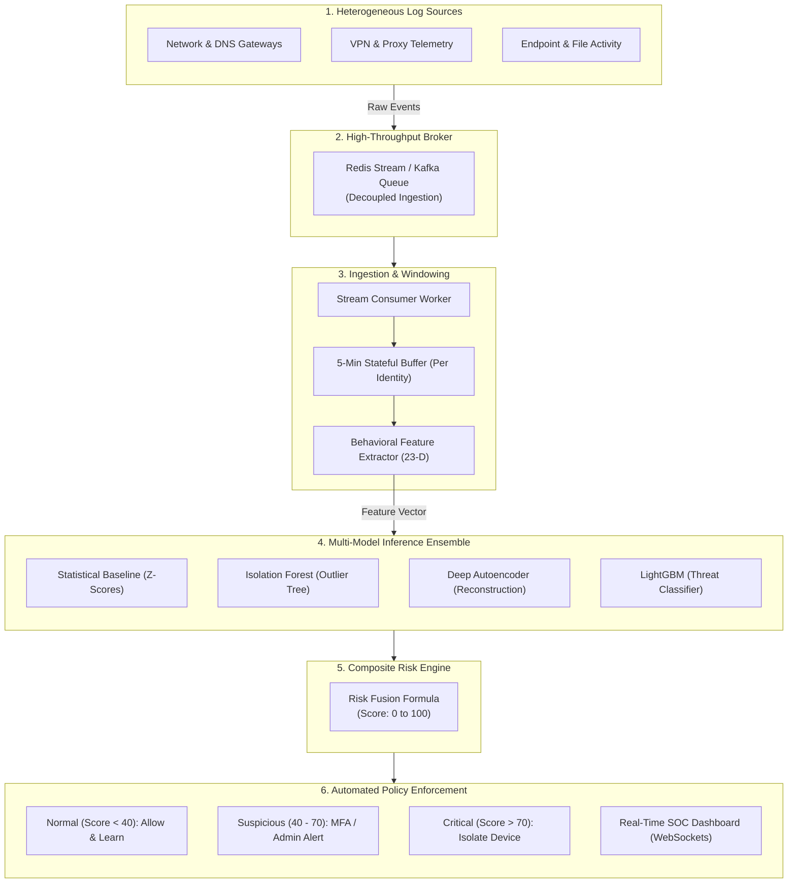
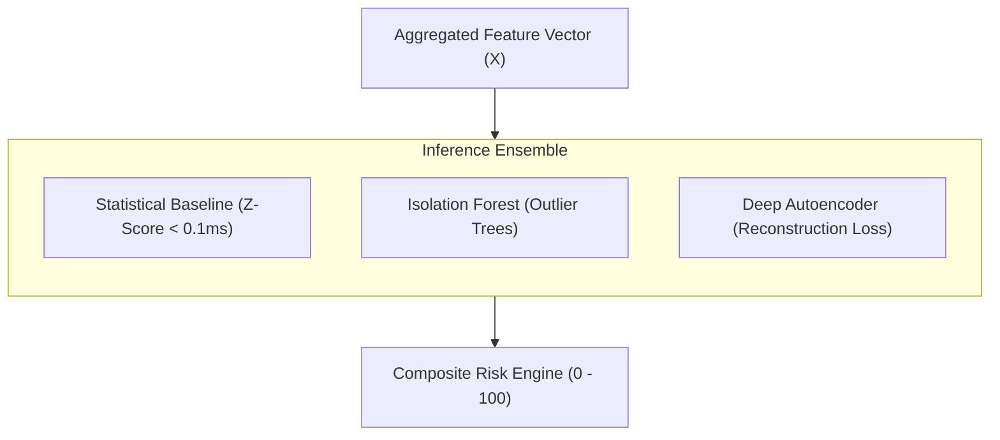
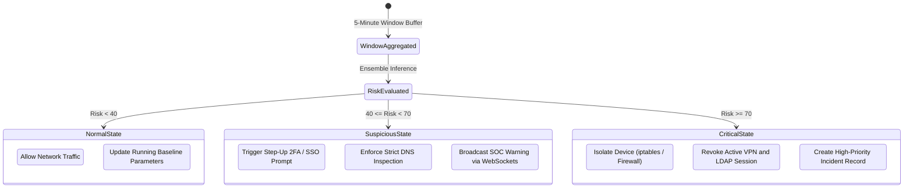

# Internal Network Adaptive Firewall: Technical Workflow & Architecture

> **Smart India Hackathon (SIH 2026)**  
> **Project Name:** *\<UNDECIDED\>*  
> **Core Concept:** Decoupled Stream Ingestion → 5-Minute Behavioral Window Aggregation → Ensemble Machine Learning Inference → Composite Risk Scoring → Automated Policy Enforcement.

---

## Executive Summary

Traditional perimeter firewalls (North-South defenses) protect network boundaries from external intruders, but remain blind to **internal threat vectors** (East-West traffic, compromised employee credentials, privilege abuse, insider data exfiltration, and lateral movement). 

Our solution provides an **Adaptive Behavioral Internal Firewall** that does not inspect single packets in isolation, but instead constructs continuous **behavioral profiles** for every authenticated identity/device. 

By decoupling heterogeneous log collection through a **high-throughput message broker**, buffering activity across **5-minute sliding/tumbling windows**, and running a **multi-model ensemble** to compute a **composite risk score**, the system detects subtle anomalies and automatically triggers **real-time defensive mitigations** (such as DNS sinkholing, device quarantine, session termination, or MFA challenge).

---

## High-Level System Architecture



---

## Step-by-Step Technical Workflow

### Step 1: Heterogeneous Log Generation & Ingestion
Independent network agents and infrastructure services continuously stream raw telemetry without needing custom synchronization:
- **DNS Gateways & Proxy Logs:** Domain queries, external/internal destination IPs, HTTP methods, status codes, bytes uploaded/downloaded.
- **Endpoint / Device Services:** Removable media connections (USB insertions), local file copy/deletion events, process executions.
- **Identity & Authentication:** LDAP logons, after-hours access timestamps, privilege escalation attempts.

Each independent service packages its event into a standardized JSON payload and pushes it asynchronously to the broker using non-blocking I/O.

```json
{
  "event_id": "evt-88492-af",
  "timestamp": "2026-08-19T02:14:32Z",
  "user": "EMP-0419",
  "src_ip": "10.0.4.52",
  "dst_ip": "198.51.100.4",
  "event_type": "file_copy",
  "details": {
    "file_name": "financial_records_q3.zip",
    "file_size_bytes": 45280000,
    "destination": "removable_usb"
  }
}
```

---

### Step 2: Decoupled Message Broker Buffering
Log ingestion is completely decoupled from machine learning computation via a **Message Broker / Stream Queue** (e.g., Redis Streams / Redis Queue / Apache Kafka):
- **Zero Backpressure on Gateways:** Network gateways publish logs at line speed without waiting for ML models.
- **Fault-Tolerant Queueing:** Events persist even during temporary backend spikes or model inference latency.
- **Horizontal Consumer Scaling:** Multiple backend workers consume from the queue using consumer groups.

---

### Step 3: 5-Minute Window Stateful Aggregation
Evaluating raw individual log lines with complex deep learning models is both computationally prohibitive and context-blind (e.g., a single DNS request is not malicious, but 2,000 queries in 5 minutes at 2:00 AM is).

The backend maintains a **Stateful Sliding / Tumbling Window** (default: **5 minutes**, configurable):
1. **Entity Partitioning:** Incoming events are hashed and routed to their respective `user_id` / `src_ip` window state.
2. **Time-Series Accumulation:** Events within $[t, t + 5\text{ min}]$ are held in an in-memory state store.
3. **Window Expiry & Trigger:** When the 5-minute window closes (or on sliding step intervals), the accumulated raw logs are converted into an aggregated **Behavioral Feature Vector**.

```
Time ──► | [Log 1] [Log 2] ... [Log N] | ──► Trigger Aggregation ──► Feature Vector
         |<─────── 5 Minutes ─────────>|
```

---

### Step 4: Behavioral Feature Engineering & Vectorization
The window aggregator condenses hundreds of individual log entries into a compact, numerical **23+ dimensional behavioral vector**:

| Category | Extracted Feature Dimensions |
| :--- | :--- |
| **Volumetric Metrics** | `bytes_sent_total`, `bytes_received_total`, `file_bytes_copied`, `email_attachments_size` |
| **Frequency & Rates** | `http_request_rate_per_sec`, `dns_query_count`, `failed_logins_count`, `file_access_count` |
| **Diversity & Entropy** | `unique_domains_accessed`, `new_unseen_domains_count`, `unique_destinations_count` |
| **Temporal Context** | `is_after_hours` (0/1), `hour_of_day`, `day_of_week`, `session_duration_minutes` |
| **Protocol Distribution** | `ssh_connection_ratio`, `https_vs_http_ratio`, `external_vs_internal_traffic_ratio` |
| **Physical & Peripheral** | `usb_insertions_count`, `sensitive_extension_access` (.zip, .exe, .tar, .pem) |

---

### Step 5: Ensemble Machine Learning Behavioral Prediction
Because deep ML models can have higher inference latency, our architecture employs a **Tiered & Ensemble Inference Pipeline**:



1. **Statistical User Baseline Engine ($S_{\text{base}}$):**
   - Tracks running historical mean ($\mu_u$) and variance ($\sigma_u$) for each user identity.
   - Computes multi-feature Z-scores: $Z_{u, f} = \frac{x_{u, f} - \mu_{u, f}}{\sigma_{u, f} + \epsilon}$.
   - Provides sub-millisecond immediate scoring and human-readable explanations (e.g., `+450% USB transfer, 5.2σ above baseline`).

2. **Isolation Forest Tree Ensemble ($S_{\text{if}}$):**
   - Partitions multidimensional feature space to isolate rare, anomalous combinations.
   - Robust to outliers with normalized $[0, 1]$ anomaly probability.

3. **Deep PyTorch Autoencoder ($S_{\text{ae}}$):**
   - Symmetrical deep neural network ($D \to 64 \to 32 \to 16 \to 32 \to 64 \to D$) trained on legitimate baseline behavior.
   - Computes reconstruction loss: $\mathcal{L}_{\text{MSE}} = \frac{1}{D} \sum_{i=1}^D (x_i - \hat{x}_i)^2$. High loss signifies novel, complex threat patterns.

4. **LightGBM Supervised Classifier ($S_{\text{gb}}$):**
   - High-speed gradient boosting model trained on known attack patterns (CERT insider threat benchmark).

---

### Step 6: Composite Risk Scoring & Dynamic Fusion
The individual model outputs are synthesized by the **Composite Risk Engine** into a single normalized **Risk Score ($0 - 100$)**:

$$\text{Composite Risk} = 100 \times \left( w_1 S_{\text{gb}} + w_2 S_{\text{base}} + w_3 S_{\text{if}} + w_4 S_{\text{ae}} \right)$$

Where $\sum w_i = 1.0$ (e.g., $w_1 = 0.40, w_2 = 0.25, w_3 = 0.20, w_4 = 0.15$).

---

### Step 7: Automated Policy Enforcement & Mitigation Matrix
Based on the composite score, the system automatically selects and enforces security policies without waiting for human intervention:



| Risk Level | Score Range | Classification | Triggered Action |
| :--- | :--- | :--- | :--- |
| **Level 1** | $0 \le \text{Risk} < 40$ | **NORMAL** | **ALLOW:** Pass traffic; quietly update historical baseline parameters. |
| **Level 2** | $40 \le \text{Risk} < 70$ | **SUSPICIOUS** | **MONITOR & CHALLENGE:** Trigger step-up authentication (MFA); restrict access to tier-1 sensitive databases; alert SOC analysts via WebSockets. |
| **Level 3** | $70 \le \text{Risk} \le 100$ | **CRITICAL** | **AUTOMATED MITIGATION:** Instant device network isolation (`ISOLATE_DEVICE`); drop active VPN connection; block egress IP at gateway; revoke access tokens. |

---

## Key Advantages for SIH 2026 Presentation

| # | Key Advantage | Technical Explanation |
| :-: | :--- | :--- |
| **1** | **Identity-Centric Baselines** | Learns behavioral patterns per user/role rather than relying on static IP addresses or rigid signature rules. |
| **2** | **Asynchronous Stream Scaling** | Message Broker decouples log collection from heavy computation; effortlessly handles 10,000+ logs/sec with sub-millisecond queuing. |
| **3** | **5-Minute Aggregation Window** | Eliminates single-packet false positives; provides necessary time context to capture stealthy exfiltration, scans, and lateral movement. |
| **4** | **Ensemble Reliability** | Zero Single Point of Failure in ML: statistical models provide instant baseline scoring while deep learning detects novel, non-linear anomalies. |
| **5** | **Automated Closed-Loop Action** | Moves beyond passive SIEM alerting by directly executing network-level isolation, DNS filtering, and credential revocation. |

---

## Presentation Slide Breakdown (For Hackathon Pitch)

* **Slide 1: The Problem** — Perimeter firewalls fail against insider threats, compromised employee credentials, and stealthy lateral data theft.
* **Slide 2: Our Solution** — An AI-powered adaptive internal firewall utilizing message brokers, 5-minute behavioral windowing, and multi-model ensemble detection.
* **Slide 3: End-to-End Pipeline** — Independent log producers $\to$ Redis/Kafka queue $\to$ 5-minute window feature aggregator $\to$ Ensemble ML inference $\to$ Action gateway.
* **Slide 4: Behavioral Feature Vectors** — How thousands of raw DNS, proxy, EDR, and file events transform into 23 distinct behavioral signals.
* **Slide 5: Multi-Model Ensemble** — Combining fast statistical Z-score baselines, Isolation Forests, and Deep Autoencoders for explainable and robust risk scoring.
* **Slide 6: Automated Mitigation Demo** — Live demonstration showing an simulated insider attack being detected in the 5-minute window and instantly isolated at the gateway.

---

## Verification & Demo Commands

To run and verify this complete architecture locally:

```bash
# 1. Start Message Broker & Backend Services
docker compose up -d

# 2. Run the Real-Time Traffic & Threat Simulator
cd simulator
uv run python simulate.py --scenario wikileaks --target redis

# 3. Observe Real-Time Model Inference & Alerts
# Inspect backend logs or open the Web GUI / WebSocket stream:
# API Docs: http://localhost:8000/docs
# Redis UI: http://localhost:8081
```

